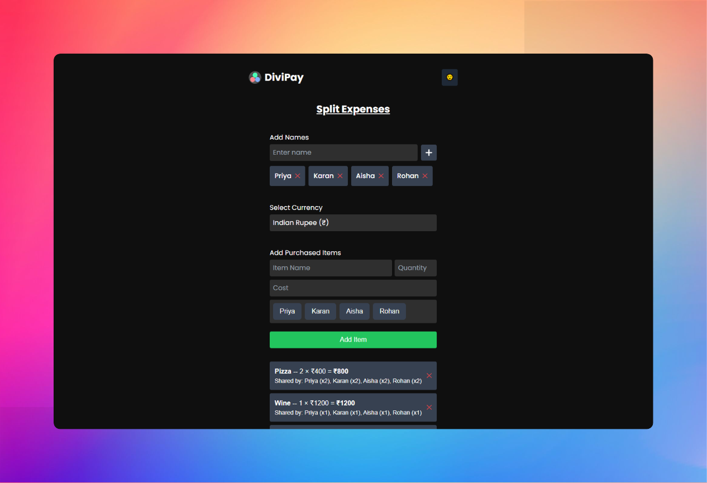

# DiviPay

**DiviPay** is a Progressive Web App (PWA) designed to simplify expense distribution among friends. It allows users to split bills easily, factoring in shared items, discounts, taxes, and payments.

<p align='center'>
  
</p>

<p align='center'>
  <a href="https://divi-pay.vercel.app/">
    
  </a>
</p>

## 🚀 Features
- **Add Participants**: Enter names of people involved in the expense.
- **Itemized Bill Splitting**: Add items with cost and specify how they are shared.
- **Custom Discounts & Taxes**: Apply multiple percentage or fixed discounts and taxes.
- **Currency Support**: Choose a currency, with rounding based on regional rules.
- **Bill Breakdown**: View distribution by person or by item.
- **PWA Support**: Installable on mobile devices for quick access.

## 🛠️ Tech Stack
- **Frontend**: Next.js, Tailwind CSS
- **Service Worker**: For PWA functionality
- **Deployment**: Vercel

## 🔧 Installation & Setup
1. Clone the repository:
   ```bash
   git clone https://github.com/aryannaik225/DiviPay.git
   ```

2. Navigate to the project directory:
   ```bash
   cd divipay
   ```

3. Install dependencies:
   ```bash
   npm install
   ```

4. Start the development server:
   ```bash
   npm run dev
   ```
5. Open `http://localhost:3000` in your browser.

## 📜 License
This project is licensed under the MIT License.

## 🤝 Contributing
- Contributions, issues, and feature requests are welcome! Feel free to open an issue or submit a pull request.

## 📬 Contact
- For any questions or suggestions, reach out via GitHub Issues.

**🌟 Star this repo if you find it useful! 🌟**
